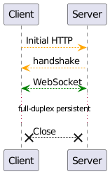
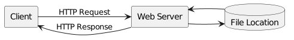
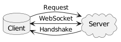
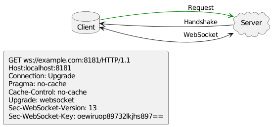
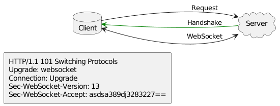

# Real-Time App with WebSocket through Django Channels

[Original post by Michael Susanto](https://medium.com/@michaelsusanto81/real-time-app-with-websocket-through-django-channels-adb436e9a17a)



Эта статья написана как часть индивидуального обзора курса разработки программного обеспечения Fasilkom UI 2021.

. . .

## Real-Time Applications?

Представьте себе создание веб-приложения, которое требует взаимодействия с сервером в реальном времени. 
Это вообще возможно? Знаете ли вы, что создание веб-приложения — это не только HTTP-запросы и HTTP-ответы. 
Мы можем подумать, что HTTP-запросы и ответы не являются взаимодействием с сервером в реальном времени. 
Сервер только ждет любых запросов от клиента, обрабатывает их, возвращает ответы, а затем готово. 
*WebSocket* может сделать больше, чем это, даже сервер может отправлять данные без предварительного запроса 
клиента, круто, верно?

## Что не так с HTTP?

HTTP (протокол передачи гипертекста) — это протокол, который позволяет получать ресурсы. Можно подумать, 
что HTTP может выполнять большую часть работы в веб-приложениях. Но что здесь не так?

Не беспокойтесь об этом, с HTTP все в порядке. Единственное, что вам нужно знать, это то, что есть одна 
вещь, которую HTTP не может сделать сам по себе, — взаимодействие в реальном времени. HTTP — строго 
однонаправленный протокол. Это означает, что мы извлекаем данные с сервера или запросы инициируются 
получателем, обычно веб-браузером (сервер пассивен).



До появления WebSocket приложения реального времени можно было создавать с помощью HTTP, выполняя длинные опросы.

Я приведу пример, чтобы объяснить, что такое Long Polling. Представьте, что есть один клиент и один сервер. 
Процесс аналогичен обычному HTTP-запросу. Клиент запрашивает сервер. Разница в том, что сервер **не сразу отвечает** 
клиенту. Он удерживает запросы до определенного времени или до тех пор, пока сервер не получит то, что нужно клиенту.

Из этого сценария я думаю, вы уже знаете, что запросы удерживаются сервером. Сервер предпочитает удерживать 
соединение клиента открытым как можно дольше, ответы даются только после того, как данные станут доступны или будет 
достигнуто пороговое значение тайм-аута. Недостаток в том, что ресурсы привязаны к определенным клиентам.

## WebSocket

WebSocket придуман для решения предыдущих проблем. Он располагается поверх стека TCP/IP устройства. В отличие от 
HTTP, WebSocket обеспечивает двунаправленную и полнодуплексную связь между клиентом и сервером, которая работает 
по протоколу HTTP через одно соединение через сокет TCP/IP.



Для взаимодействия с сервером в режиме реального времени клиент запрашивает обновление HTTP-соединения, чтобы 
открыть соединение WebSocket с сервером. Мы видим, что соединение WebSocket изначально создается из HTTP-запросов, 
которые обновляют текущее соединение.



Затем сервер примет и обновит соединение. Таким образом, выполняется рукопожатие, и затем они могут общаться 
друг с другом через WebSocket.



Сервер в соединении WebSocket не только будет слушать и давать ответы клиенту, но также может отправлять сообщение 
клиенту самостоятельно без какого-либо запуска со стороны клиента.

## Django Channels

Channels — это библиотека, которую можно интегрировать и обновить наш проект Django, чтобы он мог обрабатывать 
соединения WebSocket или соединения HTTP и WebSocket.

Чтобы обновить наш проект Django с помощью каналов, нам нужно сначала установить зависимость каналов.

```bash
pip install channels
```

В этом примере мы увидим простое приложение чата с каналами Django. 
Я расскажу об общей идее интеграции нашего проекта Django с каналами, 
чтобы вы могли узнать куда двигаться дальше после прочтения этой статьи.

Во-первых, нам нужно указать **channels** в нашем root каталоге INSTALLED_APPS 
(чтобы он мог управлять командой **runserver**).

```python
# wschat/wschat/settings.py

INSTALLED_APPS = [
    'channels',
    'django.contrib.admin',
    'django.contrib.auth',
    'django.contrib.contenttypes',
    'django.contrib.sessions',
    'django.contrib.messages',
    'django.contrib.staticfiles',
    'chat'
]
```

Затем нам нужно изменить наш asgi.py для обслуживания соединений WebSocket.

```python
# wschat/wschat/asgi.py

import os

from channels.auth import AuthMiddlewareStack
from channels.routing import ProtocolTypeRouter, URLRouter
from django.core.asgi import get_asgi_application

from wschat import chat

os.environ.setdefault('DJANGO_SETTINGS_MODULE', 'wschat.settings')

application = ProtocolTypeRouter({
    'http': get_asgi_application(),
    'websocket': AuthMiddlewareStack(
        URLRouter(
            chat.routing.websocket_urlpatterns
        )
    ),
})
```

Как видите, WebSocket имеет собственный шаблон маршрутизации, который начинается с **ws://** или **wss://**. 
Теперь давайте определим шаблоны конечных точек WebSocket в нашем приложении:

```python
# wschat/chat/routing.py

from django.urls import re_path

from . import consumers

websocket_urlpatterns = [
    re_path(r'ws/chat/(?P<room_name>\w+)/$', consumers.ChatConsumer.as_asgi()),
]
```

С помощью этого шаблона наш клиент может подключиться к нашему серверу 
через **ws(s)://<host>/ws/chat/<room_name>/**.

Теперь мы закончили с общими настройками. Поскольку мы создаем приложение для чата и не 
хотим терять историю чата, нам нужно где-то ее хранить. Наиболее часто используемый 
подход — интегрировать Redis в наши каналы. Он находится в отдельном пакете, поэтому 
сначала нам нужно его установить.

```shell
pip install channel_redis
```

```python
# wschat/wschat/settings.py
...
ASGI_APPLICATION = 'wschat.asgi.application'
CHANNEL_LAYERS = {
    'default': {
        'BACKEND': 'channels_redis.core.RedisChannelLayer',
        'CONFIG': {
            'hosts': [('127.0.0.1', 6379)],
        }
    }
}
```

Вам может быть интересно, что такое **Channels Layers**? **Channels Layers** позволяют вам общаться между разными 
экземплярами приложения. Проще говоря, мы можем думать о них как о групповых комнатах, на которые мы подписаны. 
Представьте, что вы отправляете сообщение своему другу в групповой чат А. Оно не будет доставлено в групповой 
чат Б, верно? Только участники группового чата А могут прочитать сообщение. То же самое касается слоев канала, 
у нас может быть много комнат для подписки.

Теперь, когда у нас есть готовые **Channels Layers**, мы можем настроить нашего Django WebSocket Consumer для 
подключения к клиентам.

```python
# wschat/chat/consumers.py

from channels.generic.websocket import AsyncWebsocketConsumer


class ChatConsumer(AsyncWebsocketConsumer):
    async def connect(self):
        self.room_name = self.scope['url_route']['kwargs']['room_name']
        self.room_group_name = f'chat_{self.room_name}'

        # Join room group
        await self.channel_layer.group_add(
            self.room_group_name,
            self.channel_name
        )

        await self.accept()

    async def disconnect(self, code):
        # Leave room group
        await self.channel_layer.group_discard(
            self.room_group_name,
            self.channel_name
        )
```

Поскольку WebSocket представляет собой полнодуплексную связь, рукопожатия выполняются при открытии и закрытии 
соединения с клиентом. Поскольку мы создаем приложение чата, при открытом соединении мы создадим групповой 
чат с room_name, заданным через URL-адрес, и удалим его при отключении.

Что происходит, когда один клиент отправляет чат другим клиентам через WebSocket (реализовано в функции 
chat_message)? Наш потребитель WebSocket будет слушать его и передавать сообщение другим подключенным клиентам 
в комнате (реализовано в функции receive).

```python
    async def receive(self, text_data=None, bytes_data=None):
        """
        Receive message from WebSocket
        """
        text_data_json = json.loads(text_data)
        message = text_data_json['message']

        # Send message to room group
        await self.channel_layer.group_send(
            self.room_group_name,
            {
                'type': 'chat_message',
                'message': message
            }
        )

    async def chat_message(self, event):
        """
        Receive message from room group
        """
        message = event['message']

        # Send message to WebSocket
        await self.send(text_data=json.dumps({
            'message': message
        }))
```

Теперь давайте реализуем фронтенд-сторону.

```html
<!-- chat/templates/chat/room.html -->
<!DOCTYPE html>
<html>
<head>
    <meta charset="utf-8"/>
    <title>Chat Room</title>
</head>
<body>
    <textarea id="chat-log" cols="100" rows="20"></textarea><br>
    <input id="chat-message-input" type="text" size="100"><br>
    <input id="chat-message-submit" type="button" value="Send">
    {{ room_name|json_script:"room-name" }}
    <script>
        const roomName = JSON.parse(document.getElementById('room-name').textContent);

        const chatSocket = new WebSocket(
            'ws://'
            + window.location.host
            + '/ws/chat/'
            + roomName
            + '/'
        );

        chatSocket.onmessage = function(e) {
            const data = JSON.parse(e.data);
            document.querySelector('#chat-log').value += (data.message + '\n');
        };

        chatSocket.onclose = function(e) {
            console.error('Chat socket closed unexpectedly');
        };

        document.querySelector('#chat-message-input').focus();
        document.querySelector('#chat-message-input').onkeyup = function(e) {
            if (e.keyCode === 13) {  // enter, return
                document.querySelector('#chat-message-submit').click();
            }
        };

        document.querySelector('#chat-message-submit').onclick = function(e) {
            const messageInputDom = document.querySelector('#chat-message-input');
            const message = messageInputDom.value;
            chatSocket.send(JSON.stringify({
                'message': message
            }));
            messageInputDom.value = '';
        };
    </script>
</body>
</html>
```

## ASGI через WSGI

Если вы любите Django, то могли заметить, что мы использовали ASGI вместо WSGI для обслуживания запросов HTTP и 
WebSocket. Приложения WSGI (Интерфейс шлюза веб-сервера) одновременно принимают один запрос и возвращают ответ. 
Этот единственный и синхронный вызываемый объект ограничивает WSGI для долгоживущих соединений, таких как 
соединения WebSocket.

С другой стороны, ASGI (асинхронный интерфейс шлюза сервера) является преемником успешного WSGI. Цель ASGI — 
продолжать оставаться стандартом совместимости между веб-серверами, фреймворками и приложениями, такими как 
WSGI, в асинхронном Python. С ASGI вы можете выполнять большинство асинхронных заданий с помощью Django 
(обычно веб-сервера на основе Python), поскольку WebSockets также выполняются асинхронно.


## Install 

```shell
git clone https://github.com/mrhumster/django-channels-ws.git
cd django-channels-ws
python -m venv env
pip -r install requremnents.txt
docker run -p 6379:6379 -d redis:5
python manage.py runserver
```